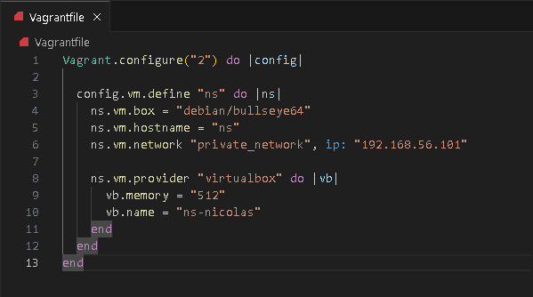
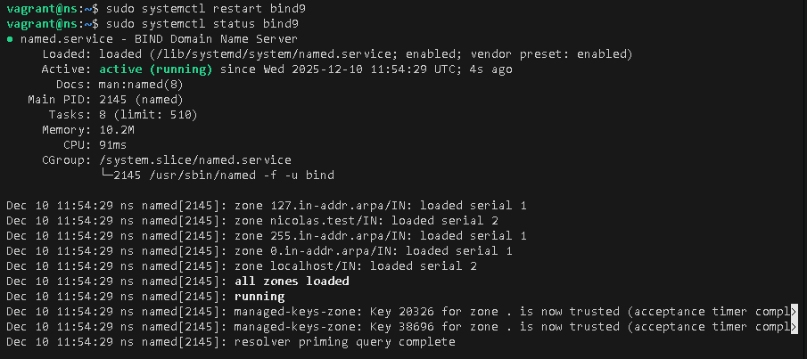
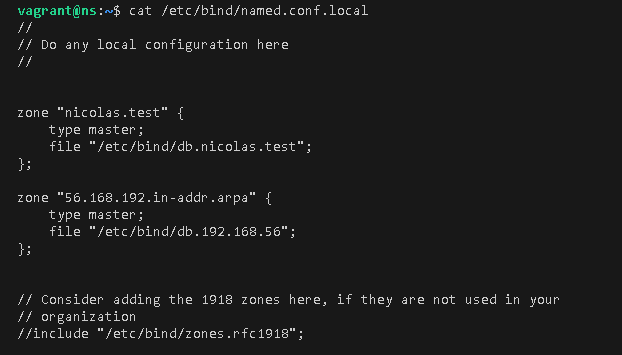
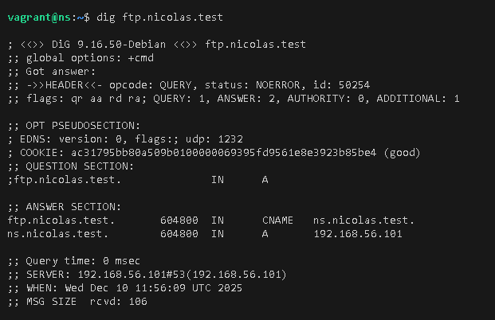
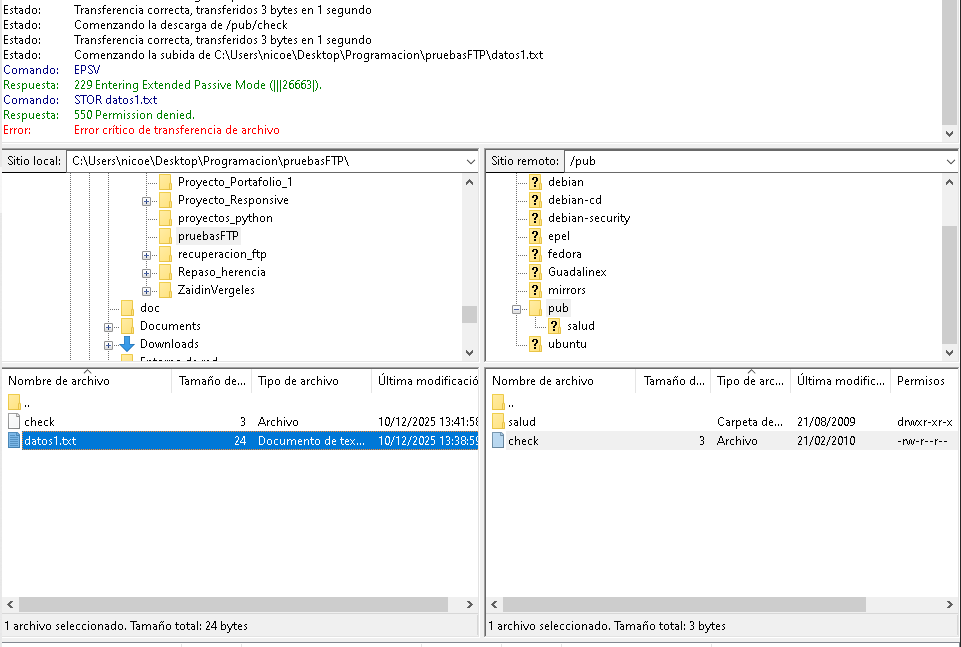
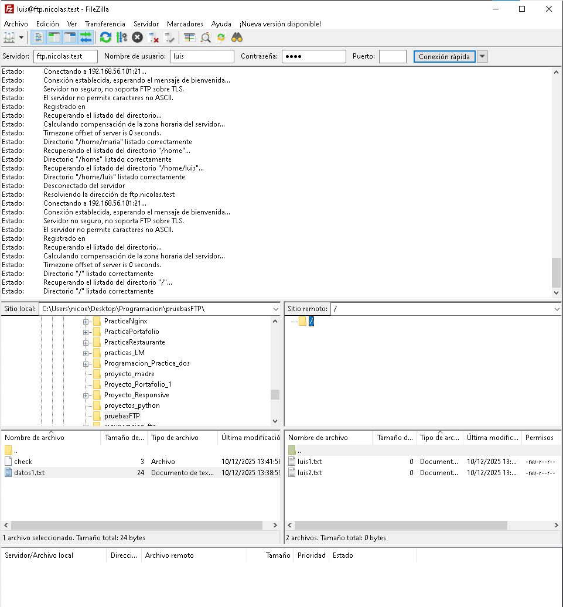
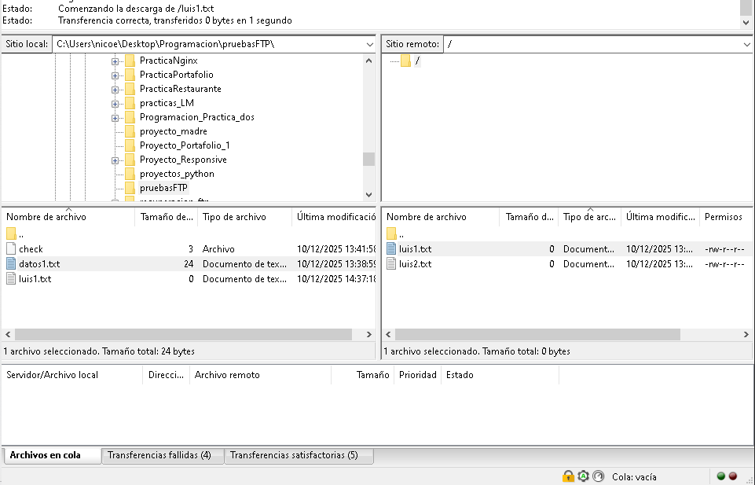
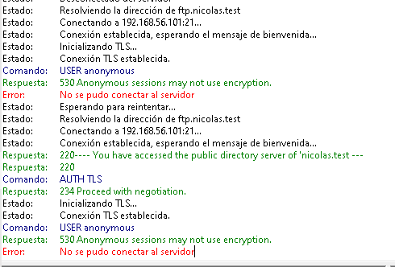
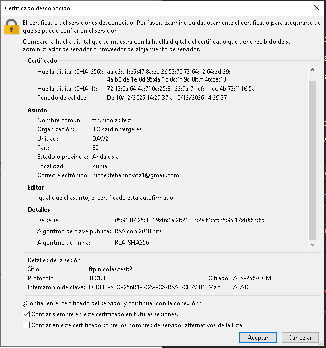

# Práctica FTP - Configuración y Administración de Servidor vsftpd

## Autor
Nicolás Esteban Lopez Novoa(nicolas.test)

## Descripción
Esta práctica documenta la configuración completa de un servidor FTP utilizando vsftpd en Debian, incluyendo la configuración DNS, conexiones seguras con FTPS, y gestión de usuarios con diferentes niveles de acceso.

---

## 1. Configuración Inicial del Entorno

### 1.1 Configuración de Red
- **Red utilizada**: 192.168.56.0/24
- **Servidor DNS/FTP**: ns.nicolas.test (192.168.56.101)
- **Alias FTP**: ftp.nicolas.test → ns.nicolas.test

### 1.2 Configuración del Servidor DNS

Se configuró un servidor DNS BIND9 en la máquina ns.nicolas.test con autoridad sobre el dominio nicolas.test y la zona de resolución inversa.



**Archivo Vagrantfile**: Configuración de la máquina virtual con IP estática 192.168.56.101.



**Estado del servicio BIND9**: El servidor DNS está activo y funcionando correctamente.

#### Archivos de zona DNS



**named.conf.local**: Configuración de las zonas nicolas.test y la zona inversa 56.168.192.in-addr.arpa.

#### Verificación DNS


**Comando**: `dig ns.nicolas.test`
- Verifica que el servidor DNS resuelve correctamente el nombre ns.nicolas.test a la IP 192.168.56.101



**Comando**: `dig ftp.nicolas.test`
- Confirma que el alias CNAME ftp.nicolas.test apunta correctamente a ns.nicolas.test (192.168.56.101)

---

## 2. Instalación y Configuración del Servidor FTP

### 2.1 Instalación de vsftpd

```bash
sudo apt update
sudo apt install vsftpd
```

### 2.2 Creación de Usuarios

Se crearon tres usuarios locales para las pruebas:

```bash
sudo useradd -m luis
sudo passwd luis

sudo useradd -m maria
sudo passwd maria

sudo useradd -m miguel
sudo passwd miguel
```

**Archivos de prueba creados**:
- `/home/luis/luis1.txt` y `/home/luis/luis2.txt`
- `/home/maria/maria1.txt` y `/home/maria/maria2.txt`

### 2.3 Configuración de vsftpd

**Características principales configuradas**:

- Modo standalone con IPv4
- Mensaje de bienvenida personalizado: "Welcome to the FTP server of 'nicolas.test'"
- Mensaje para usuarios anónimos: "You have accessed the public directory server of 'nicolas.test'"
- Timeout de inactividad: 720 segundos
- Límite de ancho de banda:
  - Usuarios autenticados: 5 MB/s
  - Usuarios anónimos: 2 MB/s
- Acceso anónimo: Solo descarga (sin permisos de escritura)
- Usuarios locales: Descarga y subida permitidas
- **Política de enjaulamiento**:
  - Usuario `maria`: NO enjaulado (puede navegar por el sistema)
  - Usuarios `luis` y `miguel`: Enjaulados en sus directorios home

---

## 3. Pruebas de Conexión FTP

### 3.1 Conexión Anónima


**Conexión anónima exitosa**:
- Se muestra el mensaje de bienvenida del servidor
- Se visualiza el mensaje específico para usuarios anónimos
- El servidor indica que no soporta FTP sobre TLS (conexión no cifrada)



**Intento de subida con usuario anónimo**:
- Se intenta subir el archivo `datos1.txt`
- El servidor responde con error 550 "Permission denied"
- Confirma que los usuarios anónimos solo tienen permisos de lectura

### 3.2 Conexión con Usuario Luis (Enjaulado)



**Conexión autenticada como luis**:
- Conexión exitosa con usuario y contraseña
- Usuario `luis` está enjaulado en su directorio `/home/luis`
- Solo puede ver su propio directorio y archivos (luis1.txt, luis2.txt)



**Descarga exitosa**:
- Se descarga el archivo `luis1.txt` desde el servidor
- El archivo aparece en el directorio local del cliente

### 3.3 Conexión con Usuario Maria (NO Enjaulado)


**Conexión autenticada como maria**:
- Usuario `maria` NO está enjaulado
- Puede navegar por todo el sistema de archivos
- Se observa acceso a `/home/luis`, `/home/maria`, `/home/miguel` y `/home/vagrant`
- Tiene permisos de lectura sobre directorios de otros usuarios

---

## 4. Configuración FTPS (FTP Seguro)

### 4.1 Generación del Certificado SSL

Se generó un certificado autofirmado para habilitar conexiones seguras:

```bash
sudo openssl req -x509 -nodes -days 365 -newkey rsa:2048 \
  -keyout /etc/ssl/certs/nicolas.test.pem \
  -out /etc/ssl/certs/nicolas.test.pem
```

### 4.2 Configuración FTPS en vsftpd

Se agregaron las siguientes directivas al archivo `/etc/vsftpd.conf`:

```
rsa_cert_file=/etc/ssl/certs/nicolas.test.pem
rsa_private_key_file=/etc/ssl/certs/nicolas.test.pem
ssl_enable=YES
allow_anon_ssl=NO
force_local_data_ssl=YES
force_local_logins_ssl=YES
ssl_tlsv1=YES
ssl_sslv2=NO
ssl_sslv3=NO
require_ssl_reuse=NO
```

**Características de seguridad**:
- Usuarios anónimos NO pueden usar SSL/TLS
- Usuarios locales DEBEN usar conexiones cifradas
- Se deshabilitan protocolos inseguros (SSLv2, SSLv3)
- Se habilita TLSv1 para compatibilidad

### 4.3 Pruebas de Conexión FTPS



**Intento de conexión anónima**:
- El servidor informa que requiere FTPS (FTP sobre TLS)
- La conexión sin cifrado es rechazada
- Mensaje: "Anonymous sessions may not use encryption"



**Certificado SSL presentado**:
- Nombre común: ftp.nicolas.test
- Organización: IES Zaidín Vergeles
- Ubicación: Zubia, Andalusia, ES
- Algoritmo: RSA con 2048 bits
- Firma: RSA-SHA256
- Protocolo: TLS 1.3 con cifrado AES-256-GCM
- El certificado está autofirmado


**Conexión segura establecida**:
- Usuario `luis` conectado mediante FTPS
- La conexión está cifrada (indicado por el candado en FileZilla)
- Se visualizan correctamente los archivos luis1.txt y luis2.txt

---

## 5. Conexión al Servidor FTP Externo (ftp.cica.es)


**Prueba de cliente FTP con servidor externo**:
- Conexión exitosa al servidor público ftp.cica.es
- Navegación al directorio `/pub`
- Descarga exitosa del archivo `check` (3 bytes)
- Intento de subida del archivo `datos1.txt` rechazado con error "Permission denied"
- Confirma el funcionamiento correcto del cliente FTP

---

## 6. Estructura del Proyecto

```
RECUPERACIONFTP/
├── .vagrant/
├── capturas/
│   ├── anonnsafe.png
│   ├── anonreject.png
│   ├── bind9configurado.png
│   ├── certfuncinando.png
│   ├── conexitosamgerror.png
│   ├── conluisjail.png
│   ├── comandoajail.png
│   ├── conseguraydescarga.png
│   ├── pruebafilezilla.png
│   ├── resoluciondns1.png
│   ├── resoluciondns2.png
│   ├── vagrantfile.png
│   └── zone.png
├── readme.md
└── Vagrantfile
```